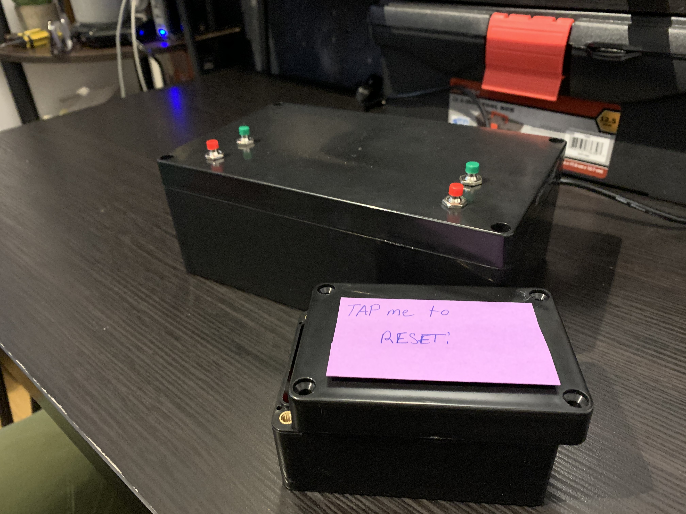

# Create-A-Show

For my final project, I decided to create a box that explores the concept of separating a seemingly seamless and cohesive piece of art  (television) into some of its different components (music, dialogue, visual). I’ve found you can create some really interesting and funny combinations! See below for how I created the Create-A-Show box, and [check it out in action!](https://www.youtube.com/watch?v=6sI_j_qrEh0).

 

## Setup 

### Necessary Hardware
- Raspberry Pi
- Momentary push button (soldered) x4
- ESP32
- 3.7v LiPo battery
- Various ribbon cables
- Keyboard
- Mouse
- Monitor w/ sound or speakers
- Digital vibration sensor

### Hardware Setup

Here is a hookup guide of the electronics for the main box:
 

And here is a hookup of the electronics for the "remote". Note that I used an ESP32 and a vibration sensor instead of the Arduino and the accelerometer:
 

Here's a picture of the actual setup of both:

#### Main Box Wiring:

##### Button 1 (Mutes the music)
- GND: Connected to GPIO pin 6 (GND)
- DO: Connected to the Raspberry Pi GPIO pin 11 (BCM 17)

##### Button 2 (Switches the music) 
- GND: Connected to GPIO pin 25 (GND)
- DO: Connected to the Raspberry Pi GPIO pin 22 (BCM 25)

##### Button 3 (Mutes the video audio) 
- GND: Connected to GPIO pin 34 (GND)
- DO: Connected to the Raspberry Pi GPIO pin 31 (BCM 6)

##### Button 4 (Switches the currently playing video) 
- GND: Connected to GPIO pin 39 (GND)
- DO: Connected to the Raspberry Pi GPIO pin 37 (BCM 26)

#### Remote Wiring:

##### LiPo Battery
- GND: Connected to a GND port on the ESP32
- VCC: Connected to the 5v port on the ESP32

##### Vibration Sensor
- GND: Connected to a GND port on the ESP32
- VCC: Connected to the 3.3v port on the ESP32
- DO: Connected to GPIO port 22 on the ESP32

### Software to Install 

#### Arduino
I used Arduino to load the arduino.ide program onto the ESP32.

#### OMXPlayer Wrapper
This is a Python package that allows you to control the native OMXPlayer on the Pi from Python commands. Simply `pip install omxplayer-wrapper`

#### Other dependencies
There are a few imports in the Python scripts that are no longer necessary - in fact, you only need the `socket`, `time`, and `OMXPlayer`
packages. You don’t need the rest.  

#### Music/Audio clips
For legal/copyright reasons, I did not load the music and video clips onto GitHub. You’ll have to grab those yourself, and change the corresponding paths in the code :)

### Running it
1. Connect the Raspberry Pi to a monitor, keyboard, and mouse 
2. On a terminal, navigate to the repo, and activate a virtual environment if you installed the dependencies that way. 
3. (skip this step if you’re not using the wireless remote) Connect the ESP32 to a LiPo battery and connect the Raspberry Pi to the ESP32_jcong WiFi network (password is “Christmas”)
4. If you didn’t use the remote, run python3 tvnowifi.py - if you did, run python3 tv.py
5. Disconnect the remote and keyboard
6. Enjoy! Use the green button on the right to switch between music clips, and hit the red button on the right to mute/unmite the music. Use the green button on the left to switch between video clips, and hit the red button on the left to mute/unmute audio from the videos.

 
 
 
